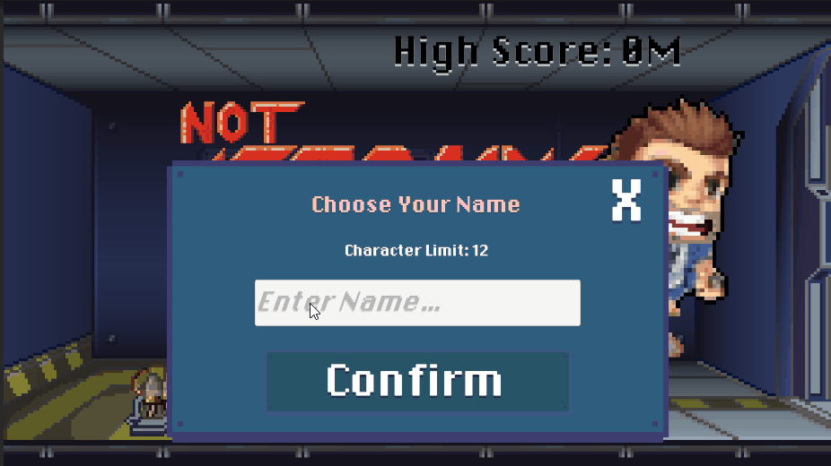
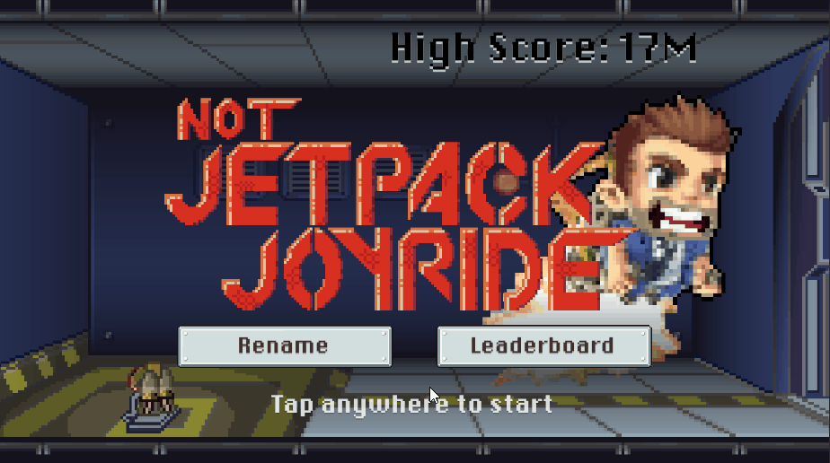
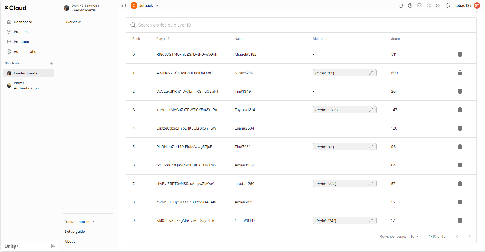

# About the Project
- A clone of the famous mobile game "Jetpack Joyride" where player need go through obstacles in a 2D side scroll setting. Player need to try try alive to earn the highest score.

# Project Information
- Unity Editor Version: 2022.3.23f1
- Project clone command:
  `
git clone https://github.com/The-Odd-Institute/NotJetpackJoyride.git
  `

  OR
- [Download](https://github.com/The-Odd-Institute/NotJetpackJoyride/archive/refs/heads/main.zip) the repository
- Folder to open and start: Scenes -> 00_Menu
  ### Packages for my parts
  - Authentication
  - Leaderboards

# Contribution to the project:
- Simple profile system setup (unity Authentication Service)
- Leaderboard system
- Local save and load system

# How are they implemented:

## Simple profile:
- Using Unity's Aunthentication Package
- The Authenticate service needed to be initialize first
- Player will be sign-in anonymous since there are no data transfering system in the current state
- It will give a random name which can be update using UpdateName method

  

## Leaderboard system/UI:
- Using Unity's Leaderboards Package
- A leaderboard need to be create on Unity's Cloud first, an ID which was named will be the thing to retrieve and push datas on the cloud
- Metadata was used so there will be some small change from the default function to push and give extra datas
- A JSON formated string will be return when request information from the Leaderboard which need to be deserialize
- Certain amount of top highscore can be retrieve
- There a prefab of the UI that have texts that can be change according the top scorers
- Those prefab objects will be instantiate and then change according to the top players from a list

### The player score before the update

  

### Player's score will be update if their score is higher than the previous highest score and store it on Cloud

  

### Player's information like ID, highest score, metadata will be store and display for easier observe and adjust

  

## Local save and load system:
- Have a main object to handle save and load
- This will go over save and load override functions finded in the classes that inheritance from IDataPersistence class
- It will be saved to the default path for different OS
- This will be inititalize everytime the game start to load the datas that been saved before

# Challenges encounter:
- Learn how Unity Cloud work and how to request and store datas being send back
- Need to get a little more familiar with aysnc since I personal have not use much before
- Scores storing on the cloud is easy but send and store metadata required a bit of time to understand and implement

# Other Contributors:
- Project Manager: Ivan Lavrentyev  
- Tech and System Lead: Leah Taurisano  
- Gameplay and Visual Programmer:
  - Character control: Taylor Daviss  
  - Particle and lasers: Nicholas Okovic  
  - Art and coin generator: Tin Ly  
  - Player controller: Miguel Ayala  
- Instructor: Amir Jahanlou  
